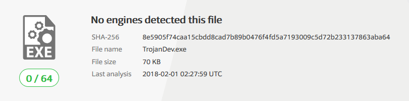

## [Antivirus Flaws]

### To view the about for this repository, please click [here.][1]
 
## Disclaimer:
 
The code and content of this repository are intended for strictly educational purposes. If you decide to do something unethical with it or with any of the ideas from it, I am not responsible for any legal consequences. You are responisble for your own actions.
 
## Table of Contents:
 
- [Goal of project]
- [Reason for writing]
- [Signature-based AV Definition]
- [My simplified understanding of how Anti-virus works]
  - [Python styled pseudo code to illustrate]
- [Typical means of obfuscation]
  - [Encoding][Typical means of obfuscation]
  - [Encryption][Typical means of obfuscation]
- [Background information for my approach]
  - [Anatomy of a Portable Executable][Background information for my approach]
  - [Variables in C++][Background information for my approach]
  - [Compiler optimization and its limits][Background information for my approach]
- [Source files explained]
- [Results]
- [Credits]

## Goal of the project:

The goal of this project was to create a simple method of taking known bad shellcode and storing it on disk in a way that disrupts the "signature" that modern antivirus systems search for. Using the python script and .cpp file in the repository, we are able to show how trivial it is to accomplish this by leveraging a base understanding of variables and how they are stored in a PE file.

## Reason for writing:

This project was done as a topic for my Information Security course at Western Connecticut State University. This particular topic was chosen after taking the [Cracking the Perimeter course from Offensive Security][2]. Using information gained from their courses in addition to some basic work with anti-virus in the IT field, I was able to come up with an idea on what doesn't get caught and why. This led me to a system of automating the generation of what doesnt work for anti-virus and a proof of concept on how to implement it. 

## Signature-based AV Definition:

Looking at the [most credible resource on the internet], we can see that signature-based antivirus is dependent on a security firm having some of the malicious software so that they can examine it and add the malicious portion of the code that can be recognized to a signature database. This signature database will be pushed to the anti-virus clients and will 

## My simplified understanding of how Anti-virus works:

Moving to give my own understanding, I feel as though it is important to share the same concepts and vocabulary for the following terms.

- **File**: A file is document that consists of a sequence of bytes. These files can be told to execute something (Like an application) or can be opened by something else to display content (Ex: Adobe reader opens up a pdf).
- **Signature**: A signature is a string of bytes that have been reviewed by whatever company lists them as malicious and adds them to a Signature database.
- **Anti-virus client**: An anti-virus client is a piece of software that pulls a copy of a signature database and can preform scans on a file or a set of files.

Going off of this my understanding of signature based antivirus can be broken into 3 parts, only 2 of which are relevant for this document. Part 1 is the anti-virus client, Part 2 is the signature database which can be seen as some data structure of byte strings (each being a signature), and Part 3 is the upstream server from which the signature databases are pulled. In the following section, I will be writing up some code in python to give my best (oversimplified) rendition of how an anti-virus functions.

#### Python styled pseudo code to illustrate:

```Python
signatureDB[] = [#SIGNATURE STRINGS]
def scan(fileIn, ):
	with open fileIn as scanFile:
		for signature in signatureDB:
			if signature in scanFile:
				return ("Malware detected as " + signature)
		return "Clean file, enjoy opening!"
print(scan(#FILENAME))	
```

## Typical means of obfuscation:

- **Encoding**: Encoding is the process of taking a section of hex in a file that is known to be the signature picked up by anti-virus systems and running it though an encoding scheme to get a set of bytes that do not match the initial signature, but can be decoded through the inverse operation and run as normal. To get a good understanding of this approach, I recommend the Cracking the Perimeter course from Offensive Security. The course gives a good look at how to set up a loop to do the encoding and decoding. That being said, a loop to decode needs to be on disk and this loop itself can be registered as a signature.
- **Encryption**: Encryption is the process of encrypting the string of bytes against a key. Generally speaking, the whole of a file is encrypted and a decryption stub is used to decrypt the file in a similar method to encoding/decoding. The difference is that encoding helps you avoid some characters (such as NULL bytes) where encryption is intended to ensure data confidentiality.

## Background information for my approach:

### Anatomy of a Portable Executable:

A portable executable is a file format that is native to Windows based operating systems. Because we will be compiling the C++ code on Windows, we will be generating a .exe file that will be hosting our malicious code and passing execution to it. A full breakdown of the parts or "Sections" that make up a PE formatted file can be found [here][4]. The relevant sections for this method are the data sections.

### Variables in C++:

A variable in C++, specifically a string variable, is a pointer to the beginning of an array of characters that is read until it reaches a NULL character (\x00). Because of this, the msfvenom command should include some encoding to ensure that this character is removed or avoided in the payload. Aside from that baseline information we can say that generally when metasploit generates a payload formatted for a C type payload dumps the contents of the payload into one variable. When the source code is compiled with a compiler such as GCC or Visual Studio it will create a character array (a contiguous block of memory) and place the bytes in the order that they were in the literal string assigned to it. This leads to our problem with the signature detection. The bytes stored in order allow for easy definition of malicious code and thus generation of a signature.

### Compiler optimization and its limits:

It is generally understood when programming that any compiler that is worth using will not generate files exactly as you dictate via your code. Compilers look to find ways to optimize operations to give you the best performance (which is not always their end result). I have noticed that if you have 3 strings declared as {"DEF", "ABC", "GHI"} and you want a program that does nothing with them but print them in order, the compiler will not take the 3 strings and store them in the proper order or as one correctly ordered string. While this is good as this would likely lead to more trouble than it was worth, it gives way to what I feel is the easiest method of bypassing antivirus signatures entirely.

## Breakdown of the method used:

Reading the last 3 sections, the process is likely to be fairly obvious at this point. For illustration purposes, I will be using some 'variables' defined below.
```
- malicious-signature = 'ABCDEFGHIJ'
- malicious-code = 'ABCDEFGHIJ'
- string chunk1 = 'CD'
- string chunk2 = 'IJ'
- string chunk3 = 'EF'
- string chunk4 = 'AB'
- string chunk5 = 'GH'
- string* chunkArr = { &chunk4, &chunk1, &chunk3, &chunk5, &chunk2 }
- char* reassembled = new char[malicious_code.length()]
```
Note: This code will not compile as it is not formatted correctly, but we can gather the general idea from it.

The signature found as malicious-signature matches exactly with malicious-code. However, if we were to exclude malicious-code from our source code and instead have the malicious-code broken down into smaller chunks and have them declared out of order, we would see the data section of our PE file read "CDIJEFABGH" which is not the same as the malicious-signature. Looking at the chunkArr, we see a string pointer array that has the pointers for each string stored in the proper order required to reassemble them. Following that, there is a char pointer named reassembled that will be a heap dynamic array that will be of the same length as the malicious code. Iterating through the chunkArr, we can dereference the pointers to get the values of the chunks and concatenate them into our heap chunkArr giving us our malicious-code back. With that, we have effectively broken the signature and used some pointers to allow us to reassemble without encryption. 

## Source files explained:

**[scramblePayload.py]** - A script written in Python3 to take the output from msfvenom as stdin and convert it to the C++ code to be pasted in the skeletonized POC. Allows you to specify the chunk size and the variable name you want given. It takes -c for the chunkSize and -vn for the C++ variable name. It returns the following items:
	
	- Randomized chunks of size given.
	- A string pointer array to all of the strings of chunks in the correct order.
	- An int of the count of the chunks.
	- An int of the total size of the payload.
	- A vector of type string* that will be instantiated to the contents of the string pointer array.

**[AVBypass_POC.cpp]** - A C++ source code containing proof of concept for the antivirus evasion method of chunking described above. The C++ code generated by the scramblePayload.py script is taken and dumped into the section commented in the Payload class as private members. This POC can be expanded upon to create trojans that serve any functions that can be expressed as shellcode. Coding the functions that are desired in assembly would give the ability to routinely change the signature in an effort to remain undetected.

## Results:

Using the standard windows/shell_reverse_tcp payload in msfvenom to connect to my localhost on port 4443 and encoding it with x86/shikata_ga_nai to avoid bytes "\x00\x0a\x0d", I dumped the results of the scramblePayload.py script into the skeletonized POC and updated the variable names to reflect the input code. Running the code I revceived a successful reverse shell. Taking this file and running it through [VirusTotal][3] the following result was had. This result shows that the method is successful in bypassing the virus signature that has been assigned to the windows/shell_reverse_tcp payload.



## Credits:

[//]: # "LINKS)"

[1]: about
[2]: https://www.offensive-security.com/information-security-training/cracking-the-perimeter/
[3]: http://www.virustotal.com
[4]: https://msdn.microsoft.com/en-us/library/windows/desktop/ms680547(v=vs.85).aspx
[Goal of project]: ./#goal-of-the-project
[Reason for writing]: ./#reason-for-writing
[Signature-based AV Definition]: ./#signature-based-av-definition
[My simplified understanding of how Anti-virus works]: ./#my-simplified-understanding-of-how-anti-virus-works
[Typical means of obfuscation]: ./#typical-means-of-obfuscation
[Background information for my approach]: ./#background-information-for-my-approach
[Source files explained]: ./#source-files-explained
[Results]: ./#results
[Credits]: ./#credits
[most credible resource on the internet]: https://en.wikipedia.org/wiki/Antivirus_software#Signature-based_detection
[Antivirus Flaws]: https://jakehomb.github.io/Antivirus_Flaws/
[Python styled pseudo code to illustrate]: ./#python-styled-pseudo-code-to-illustrate
[scramblePayload.py]: https://github.com/jakehomb/Antivirus_Flaws/blob/master/scramblePayload.py
[AVBypass_POC.cpp]: https://github.com/jakehomb/Antivirus_Flaws/blob/master/AVBypass_Skeletonized.cpp
